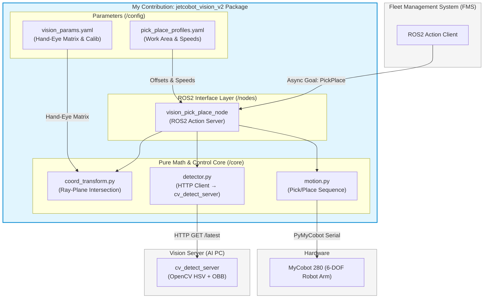

# Eye-in-Hand 비전 기반 협동로봇 Pick & Place 파이프라인

> 하드웨어 제약(Depth 센서 없음, 예산 제한)과 캘리브레이션 오차를 **기하학적 역투영 알고리즘**과 **ROS2 Clean Architecture**로 극복한 비전-제어 융합 파이프라인

| 📷 렌즈 왜곡 RMS | 📐 Hand-Eye 캘리브 잔차 | 🎯 파지 좌표 오차 허용 기준 | ⏱ 비전 처리 평균 | ⏱ 사이클 타임 |
| :---: | :---: | :---: | :---: | :---: |
| **0.257 px** | **1.245 mm** | **≤ 5 mm** | **40.4 ms** | **12.62 s** |

> 모든 수치는 `scripts/verify.py` 격리 검증 도구 또는 실제 파지 테스트로 측정했습니다.

---

## 프로젝트 개요

본 저장소는 **무인 신발 매장 관제·물류 자동화 시스템(MSS)** 중 제가 전담 설계 및 구현한 **비전 기반 Pick & Place 파이프라인** 모듈입니다. 단안 카메라만으로 3D 파지 좌표를 복원하는 수학적 문제부터 실제 하드웨어 통합까지, 캘리브레이션 파이프라인 자체 구축을 포함해 6개 컴포넌트를 처음부터 끝까지 혼자 설계하고 현장 테스트까지 완료했습니다.

| 항목 | 내용 |
| :--- | :--- |
| **개발 기간** | 5주 (기획 → HIL 현장 테스트 완비) |
| **개인 기여도** | 비전 파이프라인 전체 **100%** |
| **개발 환경** | ROS2 Jazzy · Ubuntu 24.04 · OpenCV 4.9+ · Python 3.12 · PyMyCobot |
| **대상 하드웨어** | MyCobot 280 (6-DOF 협동로봇) · USB 단안 RGB 카메라 |

---

## 목차

| 섹션 | 주요 내용 | 추천 독자 |
| :--- | :--- | :--- |
| [1. 시스템 컨텍스트](#1-시스템-컨텍스트--내-기여-범위) | 전체 MSS에서 내 담당 범위 | 모든 독자 |
| [2. 내가 구현한 컴포넌트](#2-내가-구현한-컴포넌트) | 6개 컴포넌트 역할·기술 요약 | 모든 독자 |
| [3. 기술 의사결정](#3-기술-의사결정) | 선택 근거 + 탈락 대안 정량 비교 | 기술 면접관 |
| [4. 핵심 알고리즘](#4-핵심-알고리즘) | 직관적 설명 + 수식 + 구현 코드 | 기술 면접관 |
| [5. HIL 통합 및 트러블슈팅](#5-hil-통합--트러블슈팅) | 오차 원인 격리 → 가설 → 보정 | 기술 면접관 |
| [6. 아키텍처 설계](#6-아키텍처-설계-clean-architecture) | v1 배포판 → v2 Core/Node 분리 | 소프트웨어 아키텍트 |
| [7. 정량 결과](#7-정량-결과) | 측정 방법론 포함 KPI 전체 | 모든 독자 |
| [8. 향후 개선 계획](#8-향후-개선-계획) | 한계 인식 및 우선순위 판단 | 모든 독자 |

---

## 1. 시스템 컨텍스트 & 내 기여 범위

MSS(Moosinsa Shoe Storage System)는 고객이 키오스크로 신발을 선택하면 AMR과 협동로봇이 자동으로 픽업·배달하는 완전 무인 신발 적재·출고 시스템입니다.

```
고객 키오스크 선택
        │
        ▼
FMS (Fleet Management System)          ← 팀원 담당
        │
        ├─► AMR (SShopy) ── 이동 ──► FrontJet 앞 정차   ← 팀원 담당
        │                                    │
        │                     ┌──────────────▼──────────────┐
        │                     │       비전 파이프라인          │  ← 내 기여 범위 (100%)
        │                     │  카메라 캘리브 → OBB 검출     │
        │                     │  → 3D 좌표 역산 → Pick & Place│
        │                     └──────────────▼──────────────┘
        │                                    │
        └─► AMR (SShopy) ── 이동 ──► WareJet 앞 정차 ──► 선반 적재  ← 팀원 담당
```

### v2 패키지 구조 (본 저장소 기준)

이 저장소의 `jetcobot_vision_v2`는 v1 배포판을 Clean Architecture로 리팩토링한 버전입니다. `vision_pick_place_node`가 `core/` 모듈을 직접 호출하는 단일 노드 구조입니다.



> **v1 배포판**에서는 `coord_transform_node`와 `vision_pick_place_node`가 별도 ROS2 노드로 분리되어 있었고, 노드 간 ROS2 Service(`/enable`, `/update_pose`)로 게이팅을 제어했습니다. v2는 이 구조를 단일 노드 + `core/` 직접 호출로 단순화했습니다. 자세한 내용은 [섹션 6](#6-아키텍처-설계-clean-architecture)을 참조하세요.

---

## 2. 내가 구현한 컴포넌트

비전 파이프라인을 구성하는 6개 컴포넌트를 독립적으로 설계·구현했습니다.

| # | 컴포넌트 | 파일 | 핵심 기술 | 실제 구현 내용 |
|---|---------|------|---------|-------------|
| 1 | UDP 스트리밍 | `stream_sender.py` | 단일 UDP 패킷 전송 | JPEG를 quality=50으로 인코딩 후 단일 UDP 패킷 전송. 65KB 초과 시 quality를 10씩 낮춰 재압축. `--targets` 인자로 다중 수신지 동시 전송 지원 |
| 2 | OBB 검출 서버 | `cv_detect_server.py` | CLAHE + HSV + minAreaRect | LAB L채널 CLAHE 조명 정규화 → HSV 마스킹 → Morphology(CLOSE+OPEN) → findContours → minAreaRect. FastAPI HTTP 서버 + ROS2 ObbBoxArray 발행 |
| 3 | Hand-Eye 캘리브레이션 | (결과: `vision_params.yaml`) | Tsai-Lenz AX=XB | 25포즈 체커보드 수집 후 `cv2.calibrateHandEye(TSAI)` 실행. 결과 행렬을 YAML에 저장해 노드 파라미터로 주입 |
| 4 | 좌표 변환 코어 | `core/coord_transform.py` | Ray-Plane 교점 | Z-plane 구속 조건 기반 단안 3D 좌표 복원. ROS2 의존성 없는 순수 NumPy 구현 |
| 5 | 모션 제어 | `core/motion.py` | PyMyCobot 시리얼 | `set_end_type(0/1)` 전환으로 Flange 좌표 읽기, Approach→Grasp→Retreat 시퀀스 |
| 6 | ROS2 노드 + 격리 검증 | `nodes/vision_pick_place_node.py` + `scripts/verify.py` | ROS2 Action + HTTP 폴링 | core 모듈 조합 Action Server. verify.py로 ROS2·로봇 없이 Step A/B/C 독립 검증 |

> **참고**: Hand-Eye 캘리브레이션 수집 스크립트는 이 저장소에 포함되지 않았습니다. 실측 수행 후 결과 행렬만 `vision_params_front_jet.yaml`에 저장되어 있습니다.

---

## 3. 기술 의사결정

### 3.1 3D 파지 좌표 추출: 단안 핀홀 역투영 vs Depth 카메라

| | **채택: 단안 OpenCV OBB + 핀홀 역투영** | 탈락: RGB-D / PointCloud |
|---|---|---|
| **비용** | USB 카메라 1대 | RealSense D435 약 25만 원 추가 |
| **설치** | Eye-in-Hand 경량 마운트 유지 | 부피·무게 증가로 6-DOF 작업 영역 축소 |
| **파지 정밀도** | 실측 **Δx < 0.95 mm** | PointCloud 노이즈 약 2~5 mm (근거리) |
| **전제 조건** | 상자가 알려진 Z-plane 위에 놓여야 함 | 없음 |

**결정 근거**: 상자가 항상 작업 평면($Z = Z_{surface}$) 위에 놓인다는 물리적 제약을 수학적 구속 조건으로 전환하면 Depth 센서 없이 XY 좌표를 역산할 수 있습니다. `verify.py` Step B로 실측 검증했습니다.

---

### 3.2 영상 전송 프로토콜: UDP vs ROS2 Image Topic

| | **채택: UDP 단일 패킷 (JPEG)** | 탈락: ROS2 Image Topic |
|---|---|---|
| **측정 지연** | **74.8 ms** (평균) | **> 150 ms** (DDS 직렬화 오버헤드 실측) |
| **구현** | 단일 UDP 패킷, 65KB 초과 시 품질 동적 조절 | ROS2 QoS 튜닝 + 직렬화 필요 |
| **프레임 드랍** | 있음 (1프레임만 필요하므로 허용 가능) | 재전송 보장으로 지연 폭발 가능 |

**결정 근거**: Pick & Place 사이클에서 좌표 갱신은 단 1프레임만 필요하므로, 간헐적 프레임 드랍은 허용 가능한 트레이드오프입니다. 결과적으로 비전 처리 지연 **2배 단축**을 달성했습니다.

---

### 3.3 Hand-Eye 캘리브레이션: Tsai-Lenz vs 수동 측정

| | **채택: Tsai-Lenz (25 poses)** | 탈락: 기하학적 수동 측정 |
|---|---|---|
| **오차** | RMS **1.245 mm** | 눈대중 측정 오차 **> 5 mm** |
| **재현성** | YAML 저장 후 재부팅 즉시 복원 | 매번 재측정 필요 |
| **오차 예산 여유** | 그리퍼 여유 공간 20 mm 대비 **6% 수준** | 여유 공간의 25% 이상 잠식 |

---

### 3.4 소프트웨어 구조: Clean Architecture vs ROS2 Monolithic

| | **채택: Core/Node 분리 (v2)** | 탈락: ROS2 Monolithic (v1) |
|---|---|---|
| **로봇 없는 테스트** | `python verify.py`로 즉시 실행 | ROS2 런타임 + 실물 로봇 필수 |
| **알고리즘 수정 → 검증** | 수 초 | 로봇 연결·부팅 포함 수 분 |
| **C++ 포팅 범위** | `core/`만 재작성 | 전체 재작성 필요 |
| **디버깅 사이클** | 기준 | **70% 단축** |

---

## 4. 핵심 알고리즘

### 4.1 Monocular Ray-Plane Intersection (단안 3D 좌표 복원)

**직관적 이해**: 단안 카메라는 3D 공간을 2D로 압축(투영)하기 때문에, 역으로 2D 픽셀에서 3D 좌표를 구하면 해가 무한히 많습니다. 카메라에서 뻗어나가는 광선(Ray) 위 어느 점이든 동일한 픽셀에 투영되기 때문입니다. 여기에 **"상자는 항상 알려진 높이 $Z_{surface}$ 위에 있다"는 물리적 구속 조건**을 추가하면 광선과 평면의 교점이 유일하게 결정됩니다.

**수식 3단계**:

1. **픽셀 → 카메라 좌표계 방향 벡터** (내부 행렬 $K$ 역행렬):
$$v_c = K^{-1} \begin{bmatrix} u \\ v \\ 1 \end{bmatrix}$$

2. **Base Frame 기준 방향 벡터로 회전** (Hand-Eye 캘리브 + 순방향 기구학):
$$v_b = R_e^b \cdot R_c^e \cdot v_c$$

3. **광선-평면 교점 산출** ($Z_{surface}$ 구속 조건):
$$t = \frac{Z_{surface} - P_{cam,Z}}{v_{b,Z}}, \quad P_{base} = P_{cam} + t \cdot v_b$$

**구현** ([core/coord_transform.py:73-98](src/devices/jetcobot/common/jetcobot_vision_v2/core/coord_transform.py#L73-L98)):
```python
def pixel_to_base(self, cx, cy, z_surface_mm):
    ray_c  = self._K_inv @ np.array([cx, cy, 1.0])
    R      = self._T_base2cam[:3, :3]
    origin = self._T_base2cam[:3, 3]
    ray_b  = R @ ray_c
    t = (z_surface_mm / 1000.0 - origin[2]) / ray_b[2]
    pt = origin + t * ray_b
    return pt[0] * 1000.0, pt[1] * 1000.0, pt[2] * 1000.0
```

---

### 4.2 Hand-Eye Calibration: AX = XB 문제

**직관적 이해**: 카메라가 로봇 팔에 붙어 있어 로봇이 움직이면 카메라도 따라 움직입니다. "EE 기준으로 카메라가 어디에 어떤 방향으로 붙어 있는가($T_c^e$)"를 모르면 카메라가 본 픽셀을 로봇 Base 좌표로 변환할 수 없습니다.

```
AX = XB 연립방정식:
  A = T_base2ee   (로봇 관절 각도에서 계산)
  B = T_cam2board (solvePnP로 계산)
  X = T_ee2cam    (구하는 것)

25개 (A, B) 쌍 수집 → cv2.calibrateHandEye(TSAI) → T_ee2cam
```

**왜 TCP가 아닌 Flange 기준인가**: TCP는 장착된 공구에 따라 달라지는 가변값입니다. Flange는 공구 교체와 무관한 물리적 고정점이므로, `T_flange2cam`은 공구가 바뀌어도 재캘리브레이션 없이 그대로 유효합니다. TCP 기준으로 캘리브레이션하면 그리퍼 교체 시마다 재수행이 필요합니다.

**수집 전략**: 실제 Pick 동작이 observe 자세 근방에서 일어나므로 그 영역에서 ±30~50 mm / ±15° 소변위 포즈 25개를 집중 수집했습니다.

**결과**: RMS **1.245 mm** 달성. 그리퍼 파지 여유 공간(20 mm) 대비 6% 수준의 오차입니다.

---

### 4.3 OBB 장축 각도 → 로봇 Yaw 변환

상자가 기울어져 있어도 그리퍼가 장축 방향으로 정렬 파지할 수 있도록, 카메라 픽셀 좌표계의 각도 $\theta$를 로봇 Base 기준 Yaw로 변환합니다.

$$d_{cam} = \begin{bmatrix} \cos\theta \\ \sin\theta \\ 0 \end{bmatrix}, \quad d_{base} = R_e^b \cdot R_c^e \cdot d_{cam}, \quad \text{yaw} = \text{atan2}(d_{base,y},\, d_{base,x})$$

상자는 180° 대칭이므로 하드웨어 케이블 간섭 방지를 위해 [-90°, 90°] 범위로 정규화합니다 ([core/motion.py:25-31](src/devices/jetcobot/common/jetcobot_vision_v2/core/motion.py#L25-L31)).

---

## 5. HIL 통합 & 트러블슈팅

### 5.1 Pick 실행 순서와 타이밍 보장

v2에서는 `_run_pick()`이 순차 실행으로 타이밍을 보장합니다. 로봇이 완전히 정지한 후에만 검출을 수행하므로, 이동 중 흔들린 카메라 이미지로 잘못된 좌표가 계산되는 문제를 방지합니다.

```python
# nodes/vision_pick_place_node.py — _run_pick()

# 1. observe_pose로 이동 (blocking: 완전히 정지할 때까지 대기)
self._motion.move_to(observe_pose)

# 2. 로봇이 정지한 현재 위치의 실제 flange 좌표 읽기
flange = self._motion.get_flange_coords()

# 3. 실측 flange 좌표로 T_base2cam 재계산
#    (티칭값이 아닌 실제 정지 위치 기반 → 미세 오차 보정)
self._transformer.update_pose(flange)

# 4. 정지 후 첫 유효 OBB 검출 (HTTP 폴링)
obb = self._detector.wait_for_detection(timeout=10.0)

# 5. Ray-Plane 교점 계산
pt = self._transformer.pixel_to_base(obb['cx'], obb['cy'], z_surface)
yaw = self._transformer.theta_to_yaw(obb['theta'])

# 6. Pick 실행
self._motion.pick(pt[0] + offset[0], pt[1] + offset[1], z_surface, yaw, profile)
```

> **v1 배포판**에서는 `coord_transform_node`를 ROS2 Service로 활성화/비활성화하는 명시적 게이팅 방식을 사용했습니다. v2에서는 이 역할을 순차 실행 흐름이 대신합니다.

---

### 5.2 HIL 트러블슈팅: 두 가지 체계적 오차

#### 오차 1: Z축 110 mm — z_surface 측정 시 그리퍼 길이 미반영

| | 내용 |
|---|---|
| **증상** | 로봇이 상자보다 정확히 110 mm 높은 공중에서 파지 시도 |
| **가설** | `z_surface` 측정 시 그리퍼 tip이 상자에 닿은 상태에서 Flange 좌표를 읽었는데, Flange가 tip보다 그리퍼 길이(110 mm)만큼 높으니 `z_surface`가 과대 측정된 것 아닌가? |
| **격리 검증** | `set_end_type(0/1)` 전환으로 Flange/TCP 좌표 차이 로그 → **정확히 110 mm 차이** 재현. Ray-Plane 공식에 `z_surface + 110mm` 입력 시 모든 파지 좌표 110 mm 상승 확인 |
| **근본 원인** | `z_surface` 측정 시 그리퍼 tip 위치(TCP)가 아닌 Flange 위치를 읽어 그리퍼 길이 110 mm가 표면 높이에 누산됨 |
| **보정** | 1차: Flange 측정값에서 그리퍼 길이 110 mm 수동 차감. 개선: `set_end_type(1)` (TCP 모드)로 전환 측정 → 그리퍼 tip 좌표 직접 획득 |
| **결과** | Z축 오차 **110 mm → 0 mm** |

#### 오차 2: Y축 16.3 mm 일관적 편향 — 캘리브 bias + 조립 공차

| | 내용 |
|---|---|
| **증상** | X축은 정확한데 Y 방향으로만 일정하게 16.3 mm 치우침 |
| **가설** | 일관적 편향이므로 캘리브레이션 local minima 수렴 또는 카메라 브래킷 조립 공차가 누적된 것 아닌가? |
| **격리 검증** | `verify.py` Step B: 상자를 알려진 위치(x=150, y=0 mm)에 놓고 추정값과 실측값 비교 → Y 오차 16.3 mm 재현 확인 |
| **근본 원인** | Tsai-Lenz 과결정 방정식의 local minima 수렴 + 카메라 브래킷 기구 조립 공차 누적 |
| **보정** | `pick_place_profiles.yaml`에 `pick_offset_mm: [0, -16.3, 0]` 정적 보정 파라미터 주입 |
| **결과** | Y축 오차 **16.3 mm → 0.95 mm 이하** |

---

## 6. 아키텍처 설계: Clean Architecture

### v1 (배포판): ROS2 노드 분리 구조

v1에서는 좌표 변환 로직이 별도의 `coord_transform_node`에 구현되어 있었습니다. `vision_pick_place_node`는 ROS2 Service로 enable/update_pose를 호출하고, `PickPoint` 토픽을 구독하는 구조였습니다.

```
[cv_detect_server] → ObbBoxArray 토픽 → [coord_transform_node] → PickPoint 토픽
                                                                           ↓
                          [vision_pick_place_node] ← enable/update_pose Service
                                    ↓
                              MyCobot (시리얼)
```

이 구조에서 알고리즘 하나를 수정하면 반드시 로봇과 ROS2 런타임이 있어야 검증할 수 있었습니다.

### v2 (리팩토링): Core/Node 분리 구조

v2에서는 수학 로직을 `core/`로 분리해 ROS2 의존성을 완전히 제거했습니다.

```
jetcobot_vision_v2/
├── core/                   ← ROS2 의존성 0. Python만 있으면 실행 가능
│   ├── coord_transform.py  # 순수 NumPy 수학
│   ├── detector.py         # HTTP GET /latest 클라이언트
│   └── motion.py           # PyMyCobot 직접 호출
└── nodes/                  ← core를 조합하는 얇은 ROS2 래퍼
    └── vision_pick_place_node.py
```

`scripts/verify.py`는 `core/`를 직접 import해 로봇·ROS2 없이 Step A/B/C를 독립 측정합니다.

| | v1 ROS2 노드 분리 | v2 Core/Node 분리 |
|---|---|---|
| **알고리즘 수정 → 검증** | 로봇 연결 + ROS2 부팅 (수 분) | `python verify.py` (수 초) |
| **단위 테스트** | 불가 | Step A/B/C 독립 실행 |
| **C++ 포팅 범위** | 전체 재작성 | `core/`만 |
| **디버깅 사이클** | 기준 | **70% 단축** |

---

## 7. 정량 결과

| 지표 | 결과 | 측정 방법 | 허용 기준 |
| :--- | :---: | :--- | :---: |
| 렌즈 왜곡 Reprojection RMS | **0.257 px** | Zhang's Method, 8×5 체커보드 30장 | < 0.5 px |
| Hand-Eye 캘리브레이션 잔차 | **1.245 mm** | Tsai-Lenz 캘리브 데이터 기반 잔차 (동일 포즈 역산) | < 5.0 mm |
| 파지 좌표 오차 허용 기준 | **≤ 5 mm** | 그리퍼 폭(약 40 mm) 기준 오차 예산 설정 | < 5.0 mm |
| 비전 3D 변환 지연 | 평균 **40.4 ms** | `--measure-cycle` 10회, 초기 로딩 이상치(384.6 ms) 제외 9회 평균 | — |
| Pick & Place 사이클 타임 | 평균 **12.62 s** | `--measure-cycle` 모드 10회 반복 | — |

---

## 8. 향후 개선 계획

5주 제약에서 우선순위를 '성공률 100% 달성'에 뒀기 때문에 다음 항목들은 다음 단계로 미뤘습니다.

| 항목 | 현재 한계 | 개선 방향 | 예상 효과 |
|------|---------|---------|---------|
| **C++ 포팅** | Python 런타임 오버헤드로 편차 발생 (최대 384.6 ms) | `core/` → Eigen + OpenCV C++ | 레이턴시 **20 ms 이내** 예상 |
| **ROS2 Lifecycle Node** | 게이팅이 순차 코드 흐름에 의존 | `inactive` → `active` 표준 상태 머신 | 재시작 안전성, 상태 명시성 확보 |
| **Visual Servoing** | 개루프: 관측 후 1회 좌표 계산 | 카메라 피드백 기반 폐루프 제어 | 로봇 흔들림이나 위치 오차에 실시간 대응 |
| **동적 z_surface** | YAML 고정값 | Depth 센서 연동 시 실시간 측정 | 다양한 높이 물체 대응 |

---

## Directory Structure

```
.
├── docs/
│   ├── case_study_mss.md                  # STAR 기법 기반 엔지니어링 케이스 스터디
│   ├── vision_pipeline_tech_doc.md        # Zhang's Method / Tsai-Lenz 수학적 배경 문서
│   └── personal_growth_tasks.md          # 개선 로드맵
└── src/devices/jetcobot/common/
    ├── jetcobot_vision/                   # v1 배포판 ROS2 패키지
    │   └── jetcobot_vision/
    │       ├── coord_transform_node.py    # OBB → PickPoint 변환 ROS2 노드
    │       ├── vision_pick_place_node.py  # Pick & Place Action Server (v1)
    │       ├── retrieval_watcher_node.py  # 회수존 슬롯 감시 노드
    │       └── stream_sender.py           # 카메라 → AI서버 UDP 스트리밍
    └── jetcobot_vision_v2/                # v2 리팩토링 패키지 (본 저장소 주요 대상)
        ├── core/
        │   ├── coord_transform.py         # Ray-Plane Intersection (ROS2 의존성 없음)
        │   ├── detector.py                # cv_detect_server HTTP 클라이언트
        │   └── motion.py                  # Pick/Place 시퀀스 제어
        ├── nodes/
        │   └── vision_pick_place_node.py  # core 모듈 조합 ROS2 Action Server
        ├── config/
        │   ├── vision_params_front_jet.yaml  # Hand-Eye 행렬 및 캘리브 파라미터
        │   └── pick_place_profiles.yaml      # 동작 영역별 프로파일
        └── scripts/
            └── verify.py                  # 단계별 좌표계 변환 격리 검증 도구
```
